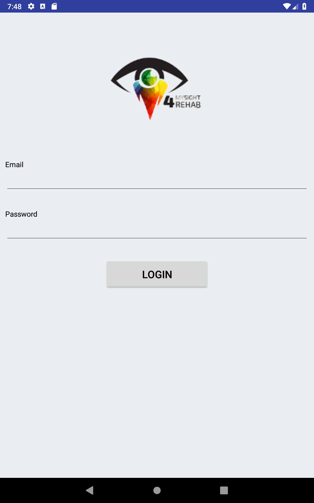
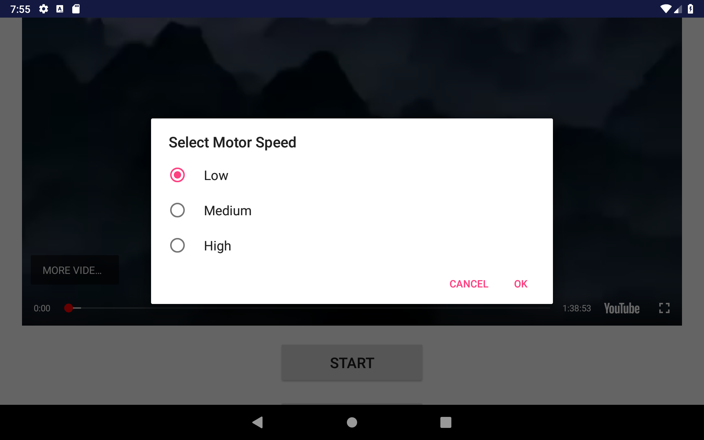

# Hand Cycle System

## Getting Started

This is a rehabilitation system designed for project name "[Development of low cost upper and lower extremities rehabilitation system with interactive feedback for children with movement disorders](https://ieeexplore.ieee.org/document/7843556)", which assists children doing exercises for upper and lower extremities.

## Deployment

Tested on Android tablets and Arduino Uno board. 

A prototype is built for demonstration purpose, as per screenshot below: 

   
   
  

## Built With

[Android Studio](https://developer.android.com/studio/) 
[Arduino IDE](https://www.arduino.cc/en/Main/Software)

## Versioning

[Semantic Versioning (SemVer) 2.0.0](http://semver.org/)

## Authors

**Jerry Chong** - [jerrychong25](https://github.com/jerrychong25) 
**Heng Yeh Tat** 
**Ng Peng Yee** 
**Marshall Loi** 
**Lee Tiong King**

## License

This project is licensed under the MIT License - see the [LICENSE.md](LICENSE.md) file for details
